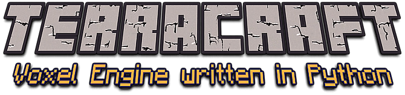

<p align="center">
<br>
<br>

</div>

[](https://www.python.org/)
[](https://GitHub.com/Naereen/StrapDown.js/graphs/commit-activity)
[](http://perso.crans.org/besson/LICENSE.html)


----------

### Goals and Vision

TerraCraft is a small SandBox game engine written in Python 3 + Pyglet.

The objectives of this project are as follows:

- The intention is to create a small complete game focused exclusively on creative mode.

- The project must remain simple, well documented (code and wiki) and easy to modify / improve for students and hobbyists. Keeping the code ordered is very important.

- I would like to see this project turn into an educational tool. Kids love Minecraft and Python is a great first language.

- This is a good opportunity to entertain children on programming.

- We are writing a new wiki to help users collaborate on the project in an easy and productive way. If you have questions, suggestions or want to help us, please write to xenon77.dev@gmail.com or open a discussion here on Github in the "Issues" section.

The code should be well commented and more easily configurable. It should be easy to make some simple changes and see the results quickly.

Thank you all.
<br>

### :dart: Goals to achieve:
<br/>

- :exclamation: Keep the code ordered, and well commented! realize documentation that is a step by step process for the long-term development of the project. Keep the project easy to understand and simple to change. The wiki is undergoing constant improvement, and will always be updated and improved over time.
- :floppy_disk: Project optimization and reorganization.
- :jack_o_lantern: Create dedicated and exclusive textures for *TerraCraft*.
- :video_game: A new inventory system, which can be recalled with the "**I**" key and a configurable hotbar (from a minimum of 8 to a maximum of 15 frames). The current inventory system allows you to select blocks using the keyboard keys 1 to 0, without displaying the active block. Removing the limit of only 10 blocks is one of the priorities of the project.
- :space_invader: Improvement of the map generation system, with the possibility of generating the terrain with the Perlin algorithm or a completely flat map. The choice can be made via the game menu when the **New World** button is activated.
- :bulb: Making a menu at the start of the game, similar to that of *Minecraft* but with a personal and easily customizable gui.
- :musical_score: Add sound effects and music that can be adjusted and deactivated in game (and from the options menu).
<br/>

### How to Run

```shell
sudo pip3 install pyglet
git clone https://github.com/XenonCoder/TerraCraft.git
cd TerraCraft
python3 main.py
```

### Mac

On Mac OS X, you may have an issue with running Pyglet in 64-bit mode. Try running Python in 32-bit mode first:

```shell
arch -i386 python3 main.py
```

If that doesn't work, set Python to run in 32-bit mode by default:

```shell
defaults write com.apple.versioner.python Prefer-32-Bit -bool yes 
```

This assumes you are using the OS X default Python.  Works on Lion 10.7 with the default Python 3.5+, and may work on other versions too.  Please raise an issue if not.

See the [wiki](https://github.com/XenonCoder/terracraft/wiki) for this project to install Python, and other tips.
<br/>

## Controls:

### Moving

- W: forward
- S: back
- A: strafe left
- D: strafe right
- Mouse: look around
- Space: jump + vertical flying up
- Tab: toggle flying mode
- Left-Shift: vertical flying down
- Left-Ctrl: run
- ESC: release mouse, then close window

### Building

- Selecting type of block to create:
    - 1: Dirt
    - 2: Dirt_with_Grass
    - 3: Sand
    - 4: Snow
    - 5: Cobblestone
    - 6: Brick_Cobblestone
    - 7: Brick
    - 8: Tree
    - 9: Leaves
    - 0: Wooden_Planks
    - Mouse left-click: remove block
    - Mouse right-click: create block
    
### Functions

- F1: toggles reticle, block highlight, and fps counter.
- F2: toggles just the fps counter.
- F5: Saving progress. The map is automatically loaded.

**Warning! By pressing F12, the previous screenshot is automatically overwritten.**

### Quitting

- ESC: release mouse, then close window

## License

Copyright (C) 2013 Michael Fogleman<br>
Copyright (C) 2018 Stefano Peris<br>

eMail: <xenon77.dev@gmail.com><br>
Github repository: <https://github.com/XenonCoder/TerraCraft>

This program is free software: you can redistribute it and/or modify
it under the terms of the GNU General Public License as published by
the Free Software Foundation, either version 3 of the License, or
(at your option) any later version.

This program is distributed in the hope that it will be useful,
but WITHOUT ANY WARRANTY; without even the implied warranty of
MERCHANTABILITY or FITNESS FOR A PARTICULAR PURPOSE.  See the
GNU General Public License for more details.

You should have received a copy of the GNU General Public License
along with this program.  If not, see <http://www.gnu.org/licenses/>.
<br>
<br>

<p align="center"><b>This software is licensed under the GPL3 license.</b>

<p align="center">

<p align="center"><i>Find a copy of the full license within this project (LICENSE).</i>
